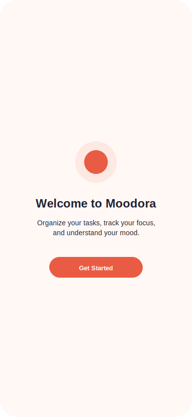
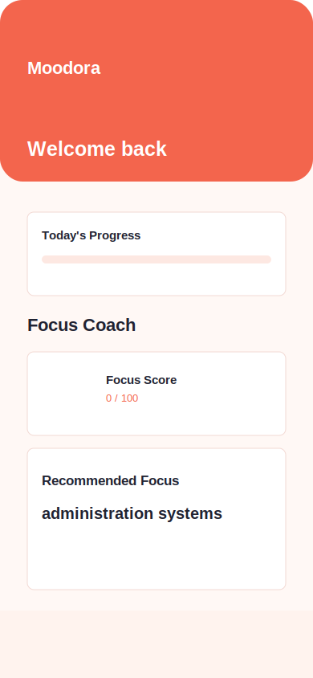
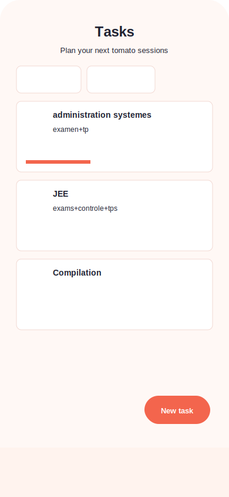
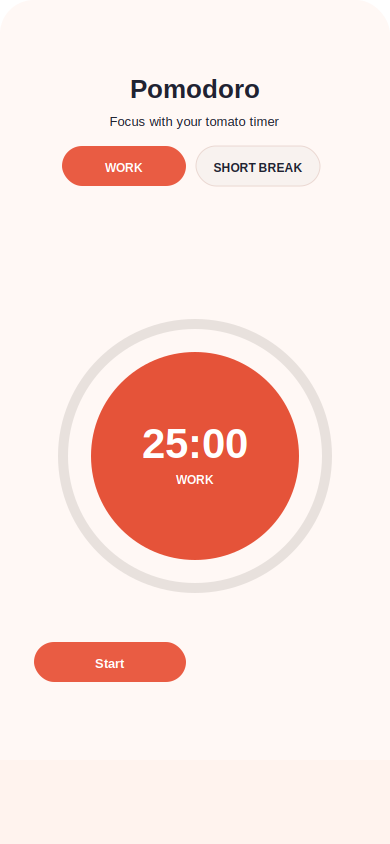
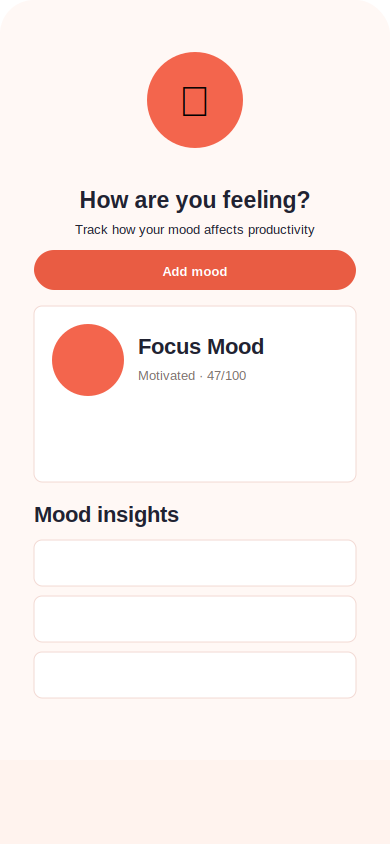
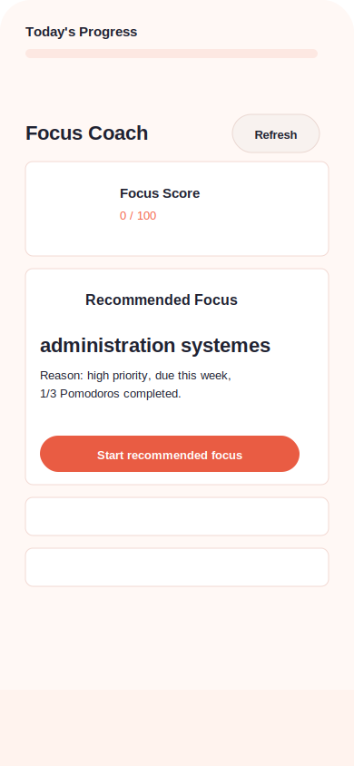
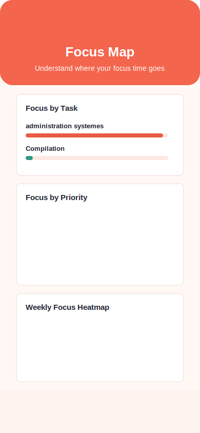
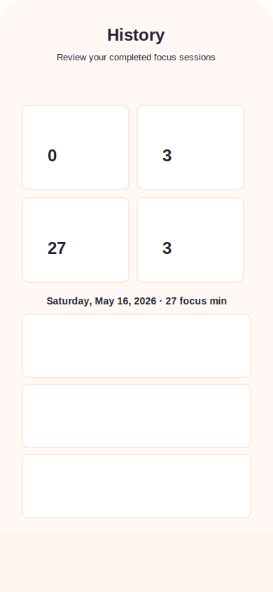
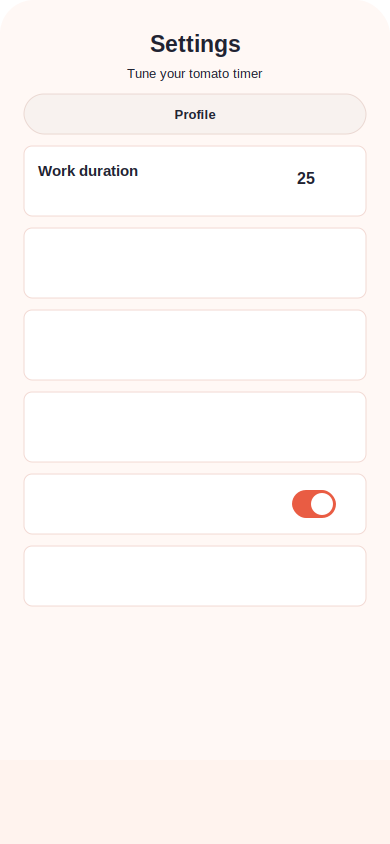
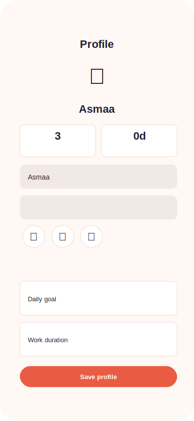

# Moodora

Moodora is a local-first Flutter Pomodoro app for planning tasks, running focus sessions, tracking mood, and reviewing productivity patterns. It stores data on-device with SQLite and supports profile-specific settings, focus statistics, and timer completion notifications.

## Features

- Pomodoro timer with work, short break, and long break modes
- Task planning with priorities, due dates, and estimated Pomodoros
- Session history with daily, weekly, and total focus statistics
- Mood tracking before and after focus sessions
- Focus coach recommendations based on tasks, goals, and recent sessions
- Focus map views for task distribution, priority alignment, and neglected tasks
- Multiple local user profiles with separate settings and data
- Light and dark themes
- Local notifications when a timer finishes

## App Screens

| Welcome | Home | Tasks |
| --- | --- | --- |
|  |  |  |

| Timer | Mood | Focus Coach |
| --- | --- | --- |
|  |  |  |

| Focus Map | History | Settings |
| --- | --- | --- |
|  |  |  |

| Profile |
| --- |
|  |

## Tech Stack

- Flutter
- Dart
- Provider for state management
- sqflite for local persistence
- flutter_local_notifications for timer alerts
- flutter_svg for SVG assets
- intl for date formatting

## Getting Started

Make sure Flutter is installed and available on your PATH.

```bash
flutter pub get
flutter run
```

To run the test suite:

```bash
flutter test
```

To build an Android debug APK:

```bash
flutter build apk --debug
```

## Project Structure

```text
lib/
  database/   SQLite database helper and DAO classes
  models/     App data models
  providers/  Provider-based state management
  screens/    App screens and navigation destinations
  services/   Focus coaching, focus maps, mood insights, notifications
  theme/      Material theme configuration
  utils/      Shared constants, colors, spacing, and formatting helpers
  widgets/    Reusable UI components
```

## Assets

The app currently uses:

```text
assets/logo/moodora_icon.svg
```

Add new assets under `assets/` and register them in `pubspec.yaml`.

## Notes

Moodora is configured as a private app with `publish_to: 'none'`. All focus, task, mood, profile, and settings data is stored locally on the device.
